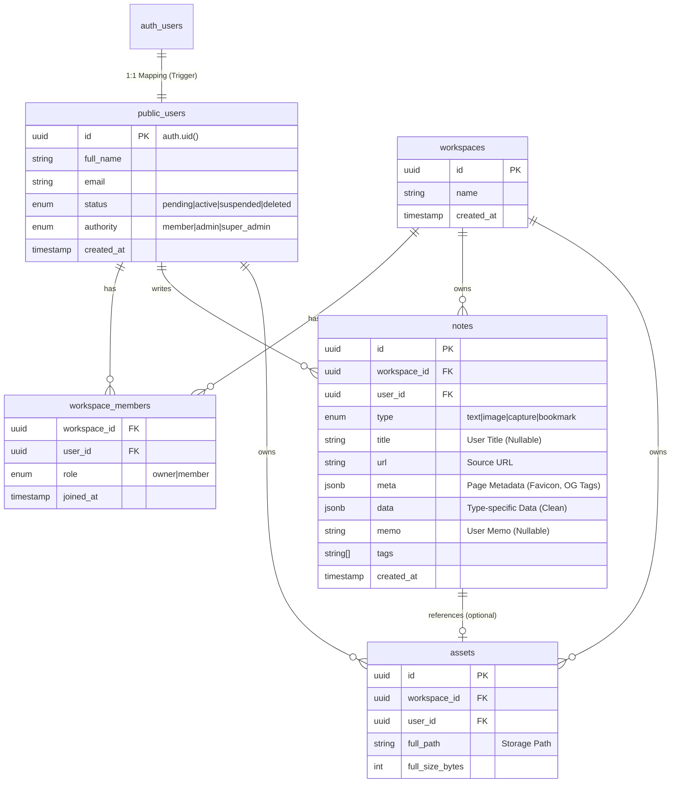

# 데이터베이스 스키마 (Database Schema)

이 문서는 Supabase Postgres 데이터베이스의 테이블 구조, 관계(ERD), 그리고 보안 정책(RLS)을 기술합니다.

## 1. 개요 (Overview)

- **Schema**: `public` 스키마를 사용합니다.
- **Authentication**: `auth.users` 테이블(Supabase 관리)과 `public.users` 테이블이 1:1로 매핑됩니다.
- **Access Control**: 모든 테이블에는 **RLS (Row Level Security)** 가 활성화되어 있습니다. 클라이언트는 직접 DB에 접근하지만, RLS 정책에 의해 허용된 데이터만 제어할 수 있습니다.

## 2. ER Diagram (ERD)

## 3. 테이블 상세 (Tables)

### 3.1 `users`
사용자 프로필 및 상태 정보를 관리합니다. `auth.users`에 레코드가 생성될 때 Trigger에 의해 자동으로 생성됩니다.

- **id**: `auth.users.id`와 동일 (Primary Key)
- **email**: 이메일 주소 (Read Only)
- **status**: 계정 상태 (`pending`, `active`, `suspended`, `deleted`)
  - `pending`: 회원가입 절차 미완료 (서비스 이용 제한)
  - `active`: 정상 이용 가능
- **is_terms_agreed**: 이용 약관 동의 여부

### 3.2 `workspaces`
데이터가 저장되는 최상위 컨테이너입니다.

- **id**: UUID
- **name**: 워크스페이스 이름

### 3.3 `workspace_members`
사용자와 워크스페이스의 N:M 관계를 정의합니다.

- **user_id**: `public.users` 참조 (**Cascade Delete**)
  - 유저 삭제 시 멤버십 정보 자동 삭제
- **workspace_id**: `workspaces` 참조
- **role**: 워크스페이스 내 권한 (`owner`, `member`)

### 3.4 `notes`
 핵심 콘텐츠인 노트를 저장합니다.

- **type**: 노트 유형 (`text`, `image`, `capture`, `bookmark`)
  - 유형에 따라 `data` 컬럼의 JSON 스키마가 달라집니다 (Discriminated Union).
- **title**: 사용자가 지정한 제목 (Nullable). 없을 경우 `meta.title`을 UI에서 폴백으로 사용(하거나 UI 로직에 따름).
- **url**: 원본 페이지 URL (필수)
- **meta**: 페이지 메타데이터 (JSONB). `favicon`, `site_name`, `description`, `image` 등 포함.
- **data**: 노트 타입별 고유 데이터 (JSONB). 예: `capture`의 `display_width` 등.
- **memo**: 사용자가 작성한 메모 (기존 `content` 컬럼).
- **workspace_id**: 소속 워크스페이스
- **user_id**: 작성자

### 3.5 `assets`
이미지 등 업로드된 파일의 메타데이터를 관리합니다.

- **id**: UUID
- **workspace_id**: 소속 워크스페이스
- **owner_id**: 업로더 (User ID)
- **type**: `image` | `capture`
- **full_path**: 원본 이미지 경로 (Supabase Storage `bitmaps/{uid}/{uuid}.png`)
- **thumb_path**: 썸네일 이미지 경로 (Nullable)
- **full_size_bytes**: 원본 파일 크기
- **thumb_size_bytes**: 썸네일 파일 크기

> **Storage Strategy**:
> - **Bucket**: `bitmaps`
> - **Structure**: `{workspace_id}/{user_id}/{uuid}.png`
>   - 워크스페이스 단위 격리 + 업로더 구분
> - **Optimization**: Supabase Image Transformation (Resize) 활용, 썸네일 별도 저장 안 함.

## 4. 데이터 무결성 및 자동화 (Triggers & Functions)

### 4.1 `handle_new_user` (Trigger)
- **이벤트**: `auth.users`에 INSERT 발생 시
- **동작**: `public.users`에 `status='pending'`으로 레코드 자동 생성
- **목적**: 회원가입 프로세스 강제화

### 4.2 `handle_orphan_workspace` (Trigger)
- **이벤트**: `workspace_members`에서 DELETE 발생 시
- **동작**: 해당 워크스페이스에 남은 멤버가 0명이면, `workspaces` 레코드도 자동 삭제
- **목적**: 구성원이 없는 유령 워크스페이스 방지

### 4.3 `complete_signup` (RPC)
- **동작**:
    1. 약관 동의(`is_terms_agreed`) 업데이트
    2. 상태를 `active`로 변경
    3. 기본 워크스페이스("내 워크스페이스") 생성 및 멤버십(`owner`) 부여
- **호출**: 프론트엔드 회원가입 페이지에서 호출

## 5. 보안 정책 (RLS)

| 테이블 | 정책 요약 |
| :--- | :--- |
| `users` | 본인 데이터만 읽기/쓰기 가능 (`id = auth.uid()`) |
| `workspaces` | 멤버십(`workspace_members`)이 있는 워크스페이스만 조회 가능 |
| `workspace_members` | 본인이 소속된 워크스페이스의 멤버 목록 조회 가능 |
| `notes` | 멤버십이 있는 워크스페이스의 노트 조회/생성 가능 |

> **주의**: `pending` 상태의 유저는 RLS와 별개로 애플리케이션 레벨(`AuthGuard`)에서 접근이 차단됩니다.
