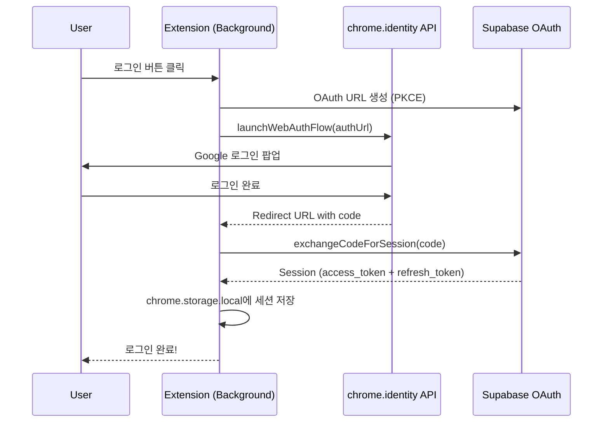

# Extension Authentication Flow (OAuth 기반)

이 문서는 Chrome Extension의 인증 플로우를 설명합니다. `chrome.identity.launchWebAuthFlow` API를 사용하여 익스텐션 내부에서 Google OAuth 로그인을 처리합니다.

## 1. 개요 (Overview)

### 설계 원칙
- **익스텐션 주체 인증**: 웹 브리지 없이 익스텐션에서 직접 로그인
- **PKCE 지원**: MV3 Service Worker 환경에서 안전한 OAuth 플로우
- **자동 토큰 갱신**: Refresh Token으로 사용자 무감지 세션 연장

### 아키텍처



## 2. 세션 유지 정책 (Session Lifetime)

| 토큰 | 유효 기간 | 설정 위치 |
|:---|:---|:---|
| **Access Token** | 1시간 (3600초) | `config.toml` → `jwt_expiry` |
| **Refresh Token** | Supabase 프로젝트 설정 (기본 7일~30일) | Dashboard → Auth Settings |

### 자동 갱신 로직

```typescript
// shared/lib/supabase.ts - getValidSession()
export async function getValidSession(): Promise<Session | null> {
  const session = await getSession();
  if (!session) return null;

  const expiresAt = session.expires_at ?? 0;
  const isExpiringSoon = expiresAt * 1000 - Date.now() < 5 * 60 * 1000; // 5분 전

  if (isExpiringSoon) {
    return refreshSession(); // 자동 갱신
  }
  return session;
}
```

### 사용자 경험

| 시나리오 | 동작 |
|:---|:---|
| Access Token 유효 | ✅ 그대로 사용 |
| Access Token 만료 임박 (5분 이내) | ✅ 자동 갱신 (사용자 무감지) |
| Refresh Token 만료 | ❌ 재로그인 필요 ("로그인 필요" 다이얼로그) |

## 3. 핵심 파일 구조

```
apps/extension/src/
├── background/
│   ├── auth.ts              # OAuth 로그인 모듈 (launchOAuthFlow)
│   └── index.ts             # LOGIN, LOGOUT 메시지 핸들러
├── shared/lib/
│   ├── chromeStorageAdapter.ts  # PKCE용 Custom Storage
│   └── supabase.ts              # Supabase 클라이언트 래퍼
└── content/ui/
    └── OverlayApp.tsx       # 로그인 UI 연결
```

## 4. Extension ID 고정

`manifest.json`의 `key` 필드로 Extension ID를 고정합니다. 이를 통해:
- 모든 개발자/환경에서 동일한 ID 사용
- Supabase redirect URL과 일치 보장
- 팀원 간 테스트 일관성

```json
{
  "key": "MIIBIjANBgkqhkiG9w0BAQEFAAOCAQ8AMIIBCgKCAQEA1Isp...",
}
```

**현재 고정된 ID**: `pgbkfbhojodldapigoomjkglijnbjlkf`

## 5. Supabase 설정

### 로컬 개발 (config.toml)

```toml
[auth.external.google]
enabled = true
client_id = "env(GOOGLE_CLIENT_ID)"
secret = "env(GOOGLE_CLIENT_SECRET)"
redirect_uri = "http://127.0.0.1:54321/auth/v1/callback"

# Extension redirect URL 필수 등록
additional_redirect_urls = [
  "http://localhost:3000",
  "http://127.0.0.1:3000",
  "https://pgbkfbhojodldapigoomjkglijnbjlkf.chromiumapp.org/"
]
```

### 프로덕션 (Supabase Dashboard)

1. **Authentication → URL Configuration**
2. **Redirect URLs**에 추가:
   - `https://pgbkfbhojodldapigoomjkglijnbjlkf.chromiumapp.org/`

## 6. 메시지 API

Background Service Worker와 통신하는 메시지 API:

| Action | 설명 | Response |
|:---|:---|:---|
| `LOGIN` | OAuth 로그인 실행 | `{ success, session }` |
| `LOGOUT` | 세션 삭제 | `{ success }` |
| `GET_SESSION` | 현재 세션 조회 | `{ success, session }` |
| `GET_USER` | 현재 사용자 정보 | `{ success, user }` |
| `IS_LOGGED_IN` | 로그인 상태 확인 | `{ success, loggedIn }` |

### 사용 예시

```typescript
// 로그인 요청
chrome.runtime.sendMessage({ action: "LOGIN" }, (response) => {
  if (response?.success) {
    console.log("로그인 성공:", response.session.user.email);
  }
});

// 로그인 상태 확인
chrome.runtime.sendMessage({ action: "IS_LOGGED_IN" }, (response) => {
  console.log("로그인 여부:", response.loggedIn);
});
```

## 7. PKCE Custom Storage

MV3 Service Worker에는 `localStorage`가 없으므로, `chrome.storage.local` 기반 Custom Storage Adapter를 사용합니다.

```typescript
// shared/lib/chromeStorageAdapter.ts
export const chromeStorageAdapter: SupportedStorage = {
  getItem: async (key) => {
    const result = await chrome.storage.local.get(key);
    return typeof result[key] === "string" ? result[key] : null;
  },
  setItem: async (key, value) => {
    await chrome.storage.local.set({ [key]: value });
  },
  removeItem: async (key) => {
    await chrome.storage.local.remove(key);
  },
};
```

## 8. 에러 처리

### 인증 에러 감지 (OverlayApp.tsx)

```typescript
const isAuthError =
  errorMessage.includes("Unauthorized") ||
  errorMessage.includes("만료") ||
  errorMessage.includes("No Workspace");

if (isAuthError) {
  // 로그인 다이얼로그 표시
  dialog.open(() => <Confirm ... />);
}
```

### 토큰 만료 시 자동 갱신 (saveNote.ts)

```typescript
if (wsError.code === "PGRST301" || wsError.message.includes("JWT expired")) {
  const newSession = await refreshSession();
  if (newSession) {
    return saveNoteToSupabase(note); // 재시도
  }
  await clearSession();
  return { success: false, error: "세션이 만료되었습니다..." };
}
```

## 9. 관련 문서

- [Extension Architecture](./extension_architecture.md)
- [Data Access Layer](./data_access_layer.md)
