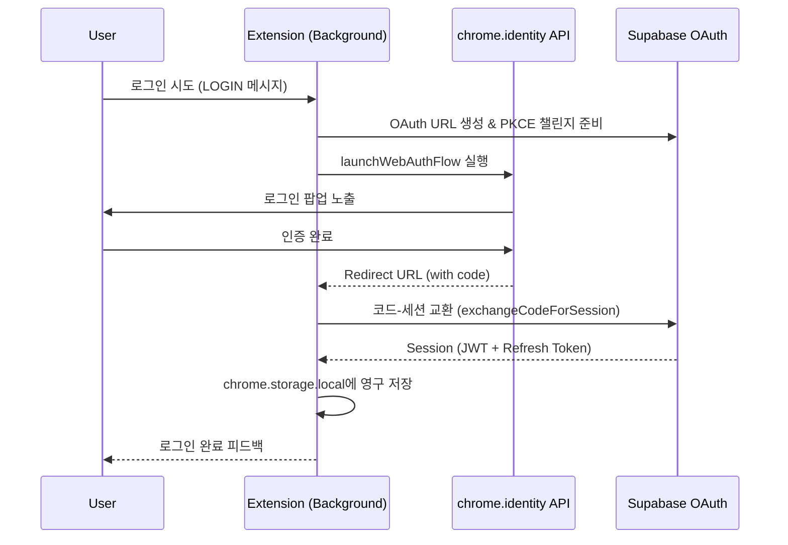

# Extension 인증 시스템 및 세션 생명주기 (Auth Architecture)

본 문서는 Pickle 크롬 익스텐션의 인증 메커니즘, OAuth 플로우, 그리고 웹 브라우저 환경에서의 세션 동기화 전략을 상세히 기술합니다.

---

## 1. 인증 설계 원칙 (Design Principles)

Pickle 익스텐션의 인증 시스템은 다음과 같은 수석 엔지니어링 원칙 하에 설계되었습니다:

1.  **독립적 주체 인증 (Native Auth)**: 별도의 웹 브리지 없이 `chrome.identity.launchWebAuthFlow`를 통해 익스텐션 자체적으로 OAuth 플로우를 완결합니다.
2.  **보안 강화된 PKCE**: MV3 Service Worker의 `localStorage` 제약을 극복하기 위해 `chrome.storage.local`을 백엔드로 하는 커스텀 스토리지 어댑터를 구현하여 PKCE(Proof Key for Code Exchange)를 지원합니다.
3.  **지연 없는 세션 전파 (Web-Ext Sync)**: 익스텐션에서 획득한 세션을 웹 애플리케이션(`apps/web`)으로 즉각 전파하여 사용자에게 통합된 경험을 제공합니다.
4.  **강력한 타입 안전성**: `SupabaseClient<Database>`와 구체적인 세션 인터페이스를 사용하여 런타임 캐스팅 에러를 방지합니다.

---

## 2. OAuth & 세션 갱신 아키텍처

### 인증 시퀀스
익스텐션 백그라운드는 수명이 짧은 Access Token의 한계를 극복하기 위해 **Silent Refresh** 패턴을 채택합니다.

### 세션 검증 알고리즘
데이터 요청 시마다 `getValidSession()`을 호출하여 토큰의 유효성을 선제적으로 검사합니다.
- **만료 5분 전 감지**: 토큰 만료가 5분 이내로 다가오면 백그라운드에서 자동으로 `refreshSession()`을 수행하여 애플리케이션 중단을 방지합니다.
- **PGRST301 대응**: 예상치 못한 JWT 만료 에러 발생 시, 즉각적인 재시도(Retry) 로직을 통해 저장 실패를 최소화합니다.

---

## 3. 확장 프로그램 메시징 API (Auth & Core)

Background Service Worker는 모든 데이터 및 인증 요청의 중앙 게이트웨이 역할을 수행합니다.

| Action (Message) | 설명 | 응답 페이로드 |
|:---|:---|:---|
| `LOGIN` | 구글 OAuth 흐름 시작 | `{ success, session }` |
| `LOGOUT` | 로컬 세션 클리어 및 로그아웃 | `{ success }` |
| `GET_SESSION` | 유효한 현재 세션 반환 (필요시 갱신) | `{ success, session }` |
| `IS_LOGGED_IN` | 인증 상태 불리언 체크 | `{ success, loggedIn }` |
| `SAVE_NOTE` | 백그라운드 DB 직접 쓰기 (RLS 적용) | `{ success, error? }` |
| `RUN_*_FLOW` | 단축키 트리거 기반 저장 프로세스 실행 | `{ success, tabId }` |

---

## 4. 웹-익스텐션 세션 동기화 (Sync Strategy)

사용자가 익스텐션에서 로그인했을 때 웹 대시보드도 자동으로 로그인되도록 하는 브릿지 엔드포인트를 사용합니다.

- **Sync 엔드포인트**: `https://picklenote.io/api/internal/auth/extension-sync`
- **동작 원리**: 
  1. 익스텐션이 성공적인 세션 획득 후 위 URL로 토큰을 전달합니다.
  2. 서버 사이드에서 `Set-Cookie`를 통해 웹 도메인의 인증 쿠키를 설정합니다.
  3. 보안을 위해 **일회용 암호화 토큰 방식**으로 고도화가 예정되어 있으며, 현재는 HTTPS 암호화 채널을 통한 파라미터 전달 방식을 사용 중입니다.

---

## 5. 보안 수칙 (Security Guidelines)

- **Sensitive Data Storage**: 사용자 세션은 반드시 `sync`가 아닌 `local` 스토리지(`chrome.storage.local`)에 저장하여 외부 동기화 위협을 차단합니다.
- **Serialization Safety**: `safeSendMessage`를 통해 전달되는 모든 인증 정보는 불변성(Immutability)을 보장하기 위해 직렬화 검증을 거칩니다.
- **RLS Enforced**: 모든 DB 직접 호출은 Supabase RLS에 의존하며, Anon Key가 탈취되더라도 타인의 데이터에 접근할 수 없도록 스키마 수준에서 방어합니다.

---

## 6. 관련 기술 가이드

- [Extension Architecture](./extension_architecture.md) - 전체적인 구조 및 iFrame 대응 전략
- [Data Access Layer](./data_access_layer.md) - 백그라운드 데이터 처리 정책
