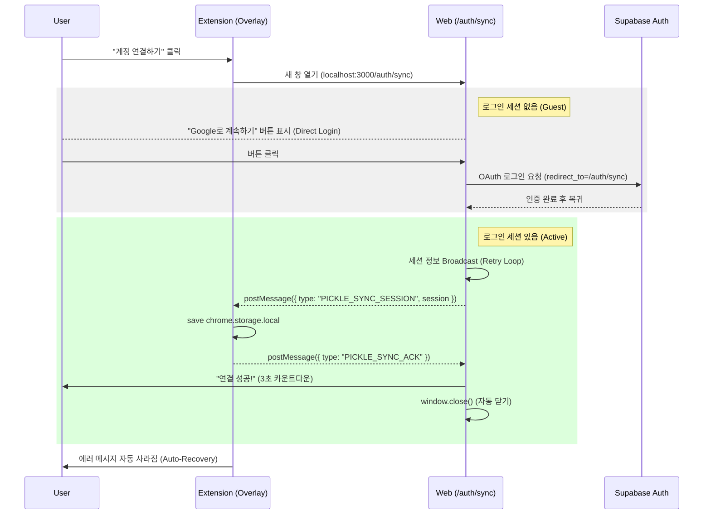

# Extension Authentication & Synchronization Flow

이 문서는 Chrome Extension과 Web Application(Supabase) 간의 인증 세션 동기화 메커니즘과 사용자 흐름을 설명합니다.

## 1. 개요 (Overview)

Chrome Extension은 보안상 Web의 Cookies/Local Storage에 직접 접근할 수 없습니다. 따라서 **웹 애플리케이션의 인증 세션을 익스텐션으로 안전하게 전달(Handshake)**하는 과정이 필요합니다.

우리는 이를 위해 `/auth/sync`라는 전용 브리지 페이지를 사용하며, 안정성을 위해 **ACK(확인) 기반의 메시지 패싱**과 **자동 복구(Auto-Recovery)** 메커니즘을 구현했습니다.

## 2. 사용자 흐름 (User Flow)

### Scenario A: 최초 연결 (First Connect)



### Scenario B: 세션 만료 및 재연결 (Re-auth)

1.  **감지**: 익스텐션이 API 호출 중 `401 Unauthorized` 또는 `JWT Expired` 에러를 받으면 토큰을 삭제하고 "계정 연결" 버튼을 다시 띄웁니다.
2.  **재연결**: 사용자가 "계정 연결" 버튼을 누르면 이미 웹에 로그인되어 있는 경우 **클릭 한 번 없이 즉시 동기화**되고 창이 닫힙니다.

## 3. 핵심 기술 구현 (Implementation Details)

### 3.1. Direct Login Page (`/auth/sync`)
*   **Redirect 제거**: 기존에는 `/`나 `/signup`으로 리다이렉트했으나, UX 단순화를 위해 `/auth/sync` 페이지 내에서 직접 "Google 로그인" 버튼을 제공합니다.
*   **Next Parameter**: 로그인 후 다시 `/auth/sync`로 돌아오도록 `redirectTo` 파라미터를 설정하여 흐름이 끊기지 않게 합니다.

### 3.2. Robust Handshake (신뢰성 있는 동기화)
*   **Retry Logic**: 웹 페이지 로드 시 익스텐션의 Content Script가 준비되지 않았을 수 있으므로, 세션 메시지를 **500ms 간격으로 5초간 반복 전송**합니다.
*   **ACK Listener**: 익스텐션이 "잘 받았다(`PICKLE_SYNC_ACK`)"는 응답을 보내면 그제서야 반복 전송을 멈추고 **초록색 성공 화면**을 띄웁니다.

### 3.3. Auto-Close & UX
*   **Countdown**: 연결 성공 시 "3초 뒤 창이 닫힙니다"라는 메시지와 함께 카운트다운을 표시하여 사용자에게 명확한 피드백을 줍니다.
*   **Auto-Recovery**: 익스텐션(`OverlayApp`)은 `chrome.storage.onChanged`를 감시하고 있다가, 새로운 세션이 들어오면 에러 UI를 즉시 치우고 사용자가 하던 작업(노트 저장)을 계속할 수 있게 합니다.

## 4. 데이터 타입 안전성 (Type Safety)
`saveNote.ts`에서 Supabase로 전송하는 데이터는 `@pickle/contracts`의 `StoredNoteData` 타입을 사용하여 엄격하게 관리됩니다.
```typescript
import type { StoredNoteData } from "@pickle/contracts/src/note";
// ...
let storedData: StoredNoteData = { ...note.data };
```
이를 통해 불필요한 필드나 타입 불일치로 인한 DB 에러를 사전에 방지합니다.
