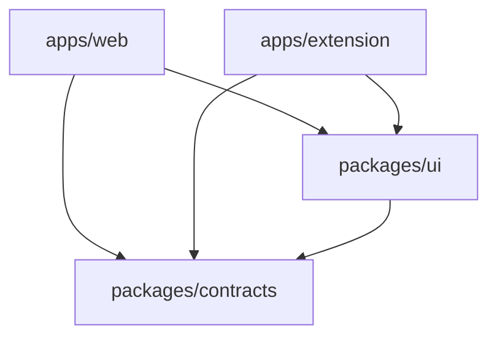

# Pickle 프로젝트 구조 (Monorepo Structure)

이 프로젝트는 `pnpm workspaces`를 사용한 모노레포 구조로 되어 있습니다.

## 📂 디렉토리 구조

```bash
root/
├── apps/               # 실행 가능한 애플리케이션 (Applications)
│   ├── web/            # Next.js App Router (메인 서비스)
│   └── extension/      # Chrome Extension (Vite + React)
│
├── packages/           # 공유 패키지 (Shared Libraries)
│   ├── contracts/      # ⭐️ 공유 타입, Zod 스키마 (Domain Truth)
│   ├── ui/             # 🎨 디자인 시스템 (shadcn/ui 기반)
│   └── tsconfig/       # 공용 TypeScript 설정
│
└── docs/               # 프로젝트 문서 (Documentation)
```

---

## 🔗 의존성 그래프 (Dependency Graph)

모든 앱은 `packages`를 참조하며, `contracts`는 가장 근본적인 의존성입니다.



## 📦 주요 패키지 설명

### 1. `apps/web` (Next.js)
*   사용자용 웹 대시보드 및 랜딩 페이지.
*   **Supabase**와 직접 통신하여 데이터를 처리합니다.
*   FSD-lite 아키텍처를 따릅니다.

### 2. `apps/extension` (Whale/Chrome Extension)
*   브라우저 사이드바에서 동작하는 확장 프로그램.
*   웹과 동일한 DB를 사용하지만, API 호출 방식이나 UI구성이 다를 수 있습니다.
*   **`@pickle/contracts`를 통해 웹과 데이터 규격을 맞춥니다.**

### 3. `packages/contracts`
*   **데이터의 규격(Schema)**을 정의하는 곳입니다.
*   TypeScript **Type**과 Zod **Schema**를 동시에 제공합니다.
*   API 요청/응답 DTO, 도메인 모델 등이 포함됩니다.

### 4. `packages/ui`
*   버튼, 인풋, 모달 등 **디자인 시스템** 컴포넌트 모음입니다.
*   TailwindCSS와 Radix UI를 기반으로 합니다.
