# 🔄 Pickle 사용자 플로우 (User Flow)

이 문서는 Pickle 서비스의 주요 사용자 여정과 화면 흐름을 정의합니다.

---

## 1. 신규 사용자 온보딩 플로우

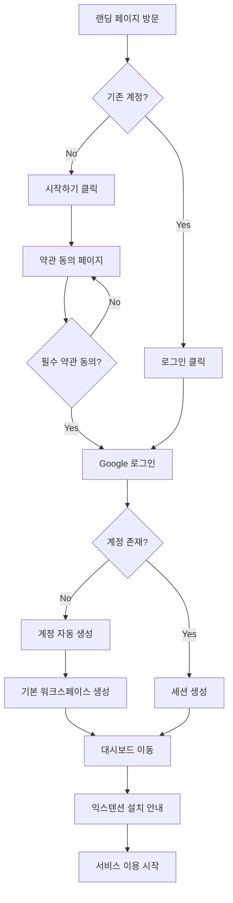

### 상세 단계

| 단계 | 화면 | 사용자 액션 | 시스템 처리 |
|:---|:---|:---|:---|
| 1 | 랜딩 (`/`) | 페이지 진입 | 서비스 소개 표시 |
| 2 | 랜딩 | "시작하기" 클릭 | 회원가입 페이지로 이동 |
| 3 | 약관 동의 (`/signup`) | 약관 체크 | 동의 상태 저장 |
| 4 | 약관 동의 | "동의하고 계속하기" 클릭 | Google OAuth 팝업 |
| 5 | Google 로그인 | 계정 선택 | 인증 토큰 발급 |
| 6 | - | - | 사용자/워크스페이스 생성 |
| 7 | 대시보드 (`/dashboard`) | - | 빈 대시보드 표시 |

---

## 2. 익스텐션 콘텐츠 저장 플로우

### 2.1 텍스트 저장

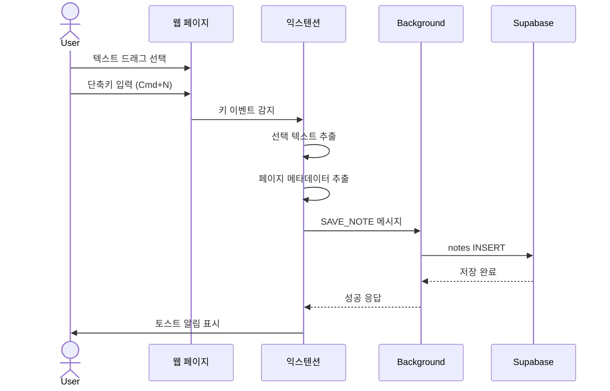

### 2.2 이미지 저장

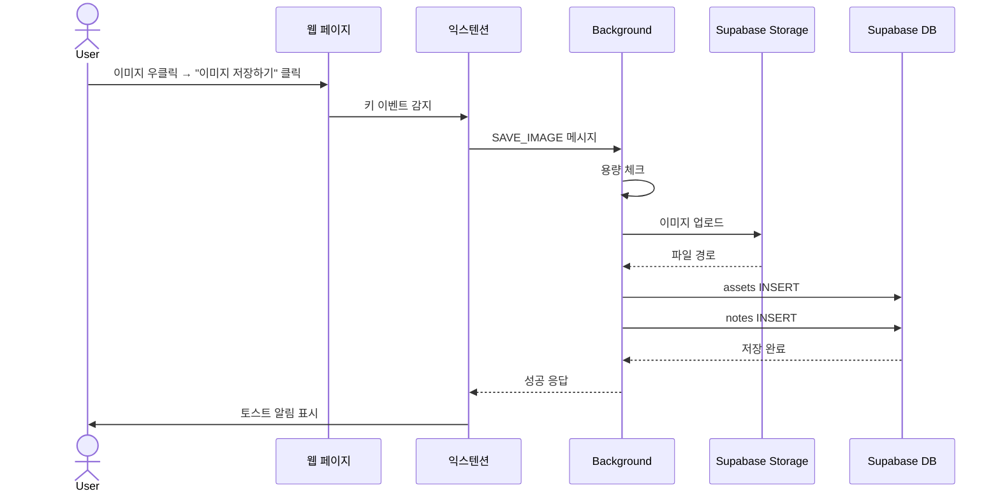

### 2.3 화면 캡처

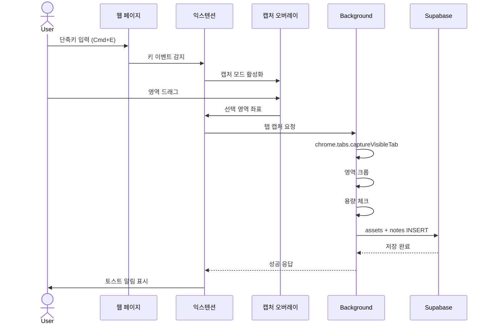

---

## 3. 웹 대시보드 주요 플로우

### 3.1 노트 검색 및 필터링

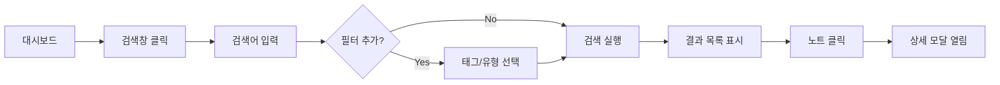

### 3.2 노트 편집

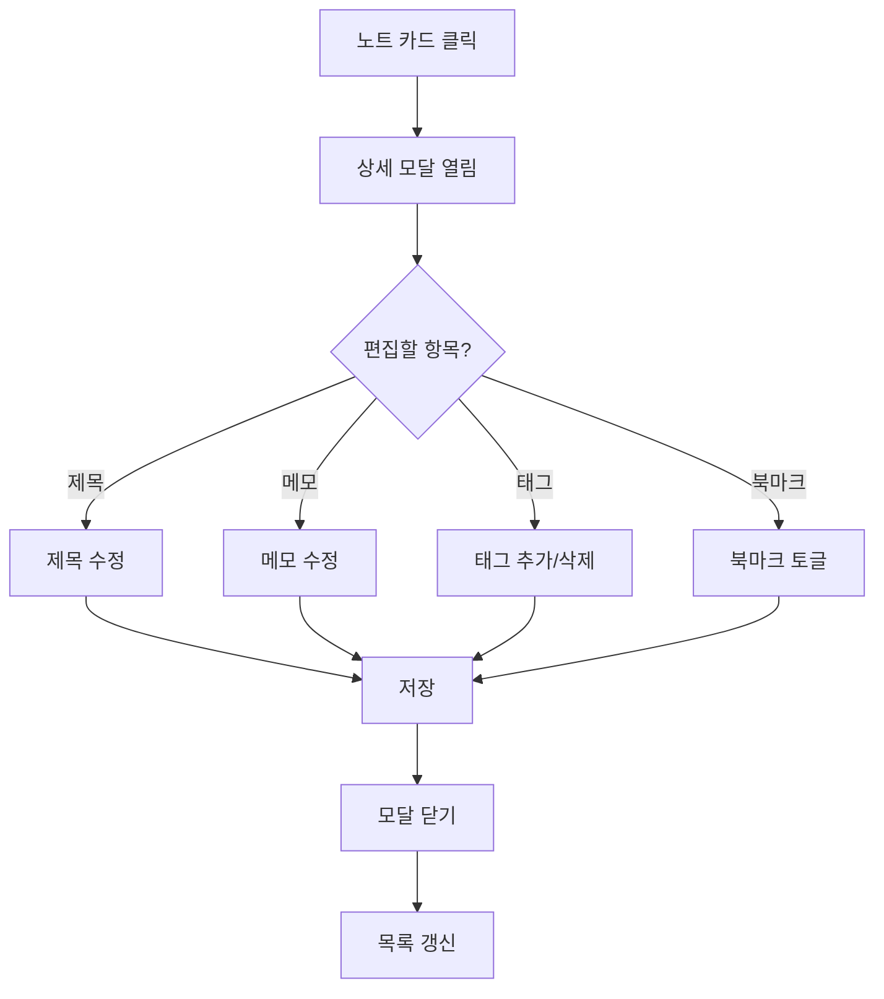

### 3.3 노트 삭제 및 복구

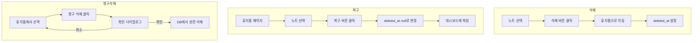

---

## 4. 계정 관리 플로우

### 4.1 회원탈퇴

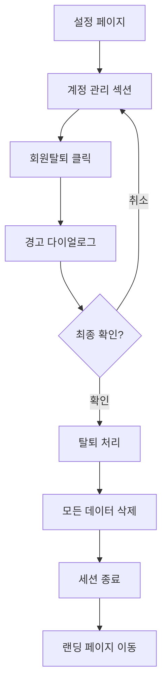

### 4.2 프로필 변경

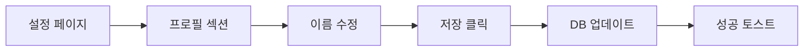

---

## 5. 상태별 화면 분기

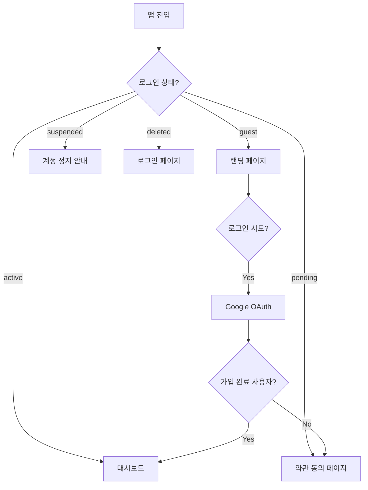

---

## 6. 에러 상황별 처리 플로우

### 6.1 네트워크 오류

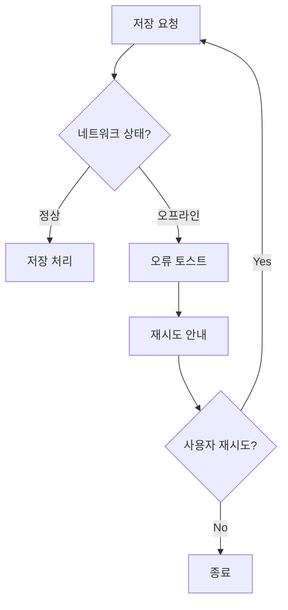

### 6.2 세션 만료

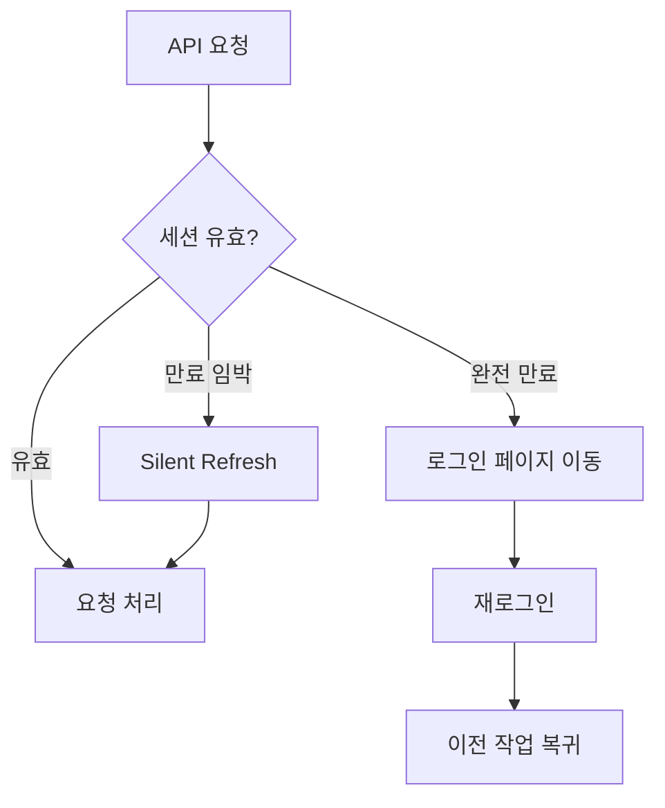

### 6.3 용량 초과

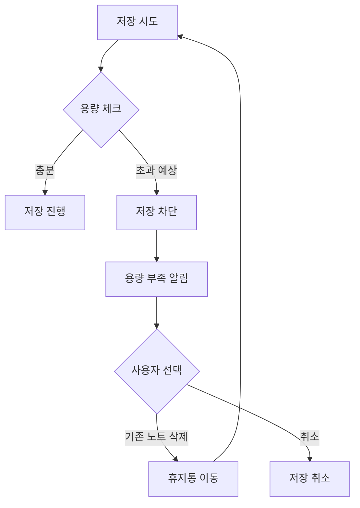

---

## 7. 화면 구성 (Screen Map)

```
/ (랜딩)
├── /signin (로그인)
├── /signup (회원가입/약관동의)
│
├── /dashboard (대시보드) ← 로그인 후 기본
│   └── 노트 상세 모달
│
├── /search (검색)
├── /bookmarks (북마크 모음)
├── /trash (휴지통)
│
├── /settings (설정)
│   ├── 프로필
│   ├── 알림 설정
│   └── 계정 관리
│
└── /legal
    ├── /terms (이용약관)
    └── /privacy (개인정보처리방침)
```

---

*이 문서는 PRD 작성을 위한 사용자 플로우 보조 자료입니다.*
