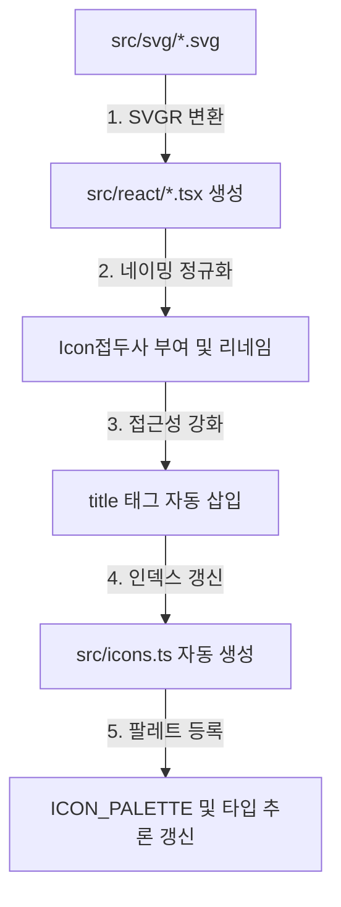

# @pickle/icons

Pickle 프로젝트의 통합 아이콘 시스템입니다. SVG 아이콘을 React 컴포넌트로 자동 변환하고, 강력한 타입 안전성을 제공합니다.

## 🚀 주요 특징

- **자동 생성**: SVG 파일을 넣고 명령어 하나만으로 React 컴포넌트와 팔레트를 생성합니다.
- **강력한 타입 안전성**: 아이콘 이름(`name`)에 따라 지원되는 사이즈(`size`)를 컴파일 타임에 정확히 추론합니다.
- **접근성(A11y) 내장**: 모든 아이콘에 `<title>` 태그가 자동으로 삽입되어 스크린 리더를 지원합니다.
- **일관된 네이밍**: 파일명, 컴포넌트명, 익스포트 명이 `Icon` 접두사로 통일되어 검색과 사용이 직관적입니다.
- **스타일링 유연성**: `currentColor`를 지원하여 CSS의 `color` 속성으로 아이콘 색상을 자유롭게 제어할 수 있습니다.

## 📦 설치 및 설정

이 패키지는 모노레포 내부의 `@pickle/ui`를 통해 제공되거나 직접 참조할 수 있습니다.

```json
// apps/web/next.config.ts
{
  "transpilePackages": ["@pickle/icons"]
}
```

## 🛠 사용 방법

### 1. `Icon` 컴포넌트 사용 (권장)
가장 일반적이고 안전한 사용 방식입니다.

```tsx
import { Icon } from "@pickle/ui"; // 또는 "@pickle/icons"

// ✅ 상위에서 지원하는 'layout' 아이콘의 20px 에셋을 타입 추론합니다.
<Icon name="layout" size={"20"} />

// ❌ 지원하지 않는 사이즈(예: 24)를 입력하면 타입 에러가 발생합니다.
<Icon name="layout" size={"24"} />
```

### 2. 개별 아이콘 컴포넌트 직접 사용
```tsx
import { IconLayout20 } from "@pickle/icons";

<IconLayout20 color="red" className="w-5 h-5" />
```

### 📏 아이콘 명명 규칙 (Naming Convention)

일관된 팔레트 생성을 위해 아래 규칙을 반드시 준수해야 합니다.

1.  **기본 형식**: `{아이콘명}-{사이즈}.svg` (예: `search-20.svg`)
2.  **하이픈(`-`)**: 이름과 사이즈를 구분하는 **예약어**입니다. 파일명의 마지막 하이픈 뒤가 사이즈로 인식됩니다.
3.  **언더스코어(`_`)**: 이름 내부에서 단어를 구분할 때 사용합니다. `ICON_PALETTE`의 키값에 그대로 보존됩니다.
    - 예: `note_full-20.svg` → `<Icon name="note_full" size={"20"} />`
4.  **권장 사항**: 모든 이름은 소문자로 작성하는 것을 권장합니다.

## ➕ 새 아이콘 추가하기

새로운 아이콘을 추가하는 프로세스는 매우 간단합니다.

1. **SVG 저장**: `packages/icons/src/svg/` 디렉토리에 위 규칙에 맞는 SVG 파일을 추가합니다.
2. **명령어 실행**: 모노레포 루트 또는 패키지 루트에서 아래 명령어를 실행합니다.
   ```bash
   pnpm icon
   ```
3. **완료**: `src/react/`에 컴포넌트가 생성되고 `src/icons.ts`의 팔레트와 빌드 결과물(`dist`)이 자동 갱신됩니다. 이제 바로 코드에서 사용할 수 있습니다.

### 🔄 아이콘 자동 생성 프로세스 상세 (Workflow)

`pnpm icon` 명령어 실행 시 내부적으로 수행되는 정규화 과정입니다.



1.  **SVGR 변환**: SVG 소스를 React TSX 컴포넌트로 변환합니다. 이때 `currentColor` 치환 및 TypeScript 설정이 적용됩니다.
2.  **네이밍 정규화**: SVGR이 생성한 기본 파일명에 `Icon` 접두사를 붙여 리네임합니다. (예: `Layout20.tsx` → `IconLayout20.tsx`)
3.  **접근성(A11y) 강화**: 바이옴(Biome) 린트 준수 및 스크린 리더 지원을 위해 컴포넌트 내부에 고정된 `<title>` 태그를 주입합니다.
4.  **팔레트 및 타입 동기화**: 리네임된 모든 파일을 스캔하여 `src/icons.ts`를 다시 씁니다. 이때 아이콘 이름과 사이즈를 분석하여 `ICON_PALETTE`를 구성하고, 자동 완성을 위한 `IconName` 타입을 갱신합니다.
5.  **Clean-up**: 변환 과정에서 생기는 불필요한 인덱스 파일 등을 삭제하여 패키지 구조를 항상 깨끗하게 유지합니다.

## ⚙️ 기술 스택

- **SVGR**: SVG to React 변환 핵심 엔진
- **tsup**: 고성능 빌드 및 타입 정의(.d.ts) 생성
- **Biome**: 프로젝트 린트 및 스타일 가이드 준수

---

Designed with ❤️ by Antigravity (Advanced Agentic Coding Team)
